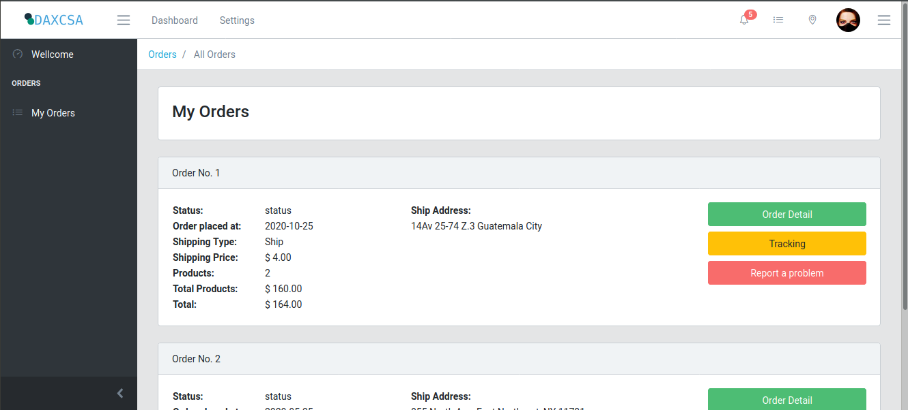
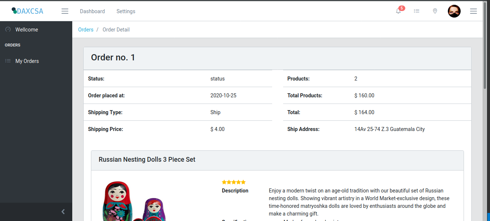
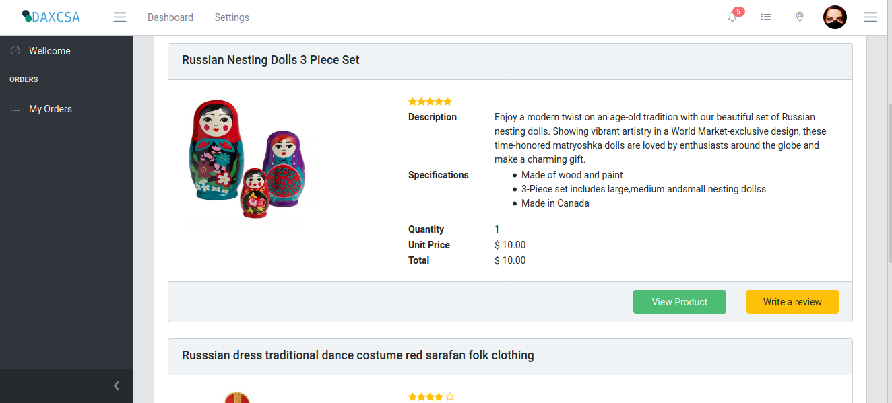

# Daxcsa E-commerce orders

### Backend: Node js
### Frontend: Angular

El front end de ete proyecto fue desarrollado con **CoreUI** en su version 2.7.2. La plantilla, su documentacion y la instalacion puede encontrarse en https://coreui.io/

Para installar el proyecto, debera dirigirse a cada carpeta (Front y Back) y ejecutar el comando 
> npm install

Para instalar todas las dependencias del proyecto. Actualmente el proyecto corre de manera local, para cambiar la direccion ip de la api, debe modificar la variable apiUrl que se encuentra en el archivo **Front/enviroment.ts/** 

Para correr el Frontend, debe posicionarse en la carpeta Front y ejecutar
> ng serve

podra acceder al proyecto con **http://localhost:4200** o la direccion ip si la ha cambiado en enviroment.ts

Para correr el Backend, debe posicionarse en la carpeta Back y ejecutar
>node index.js

Actualmente se simula un usuario logueado, el json que contiene los datos se encuentra en 
> Back/database/orders.json

El proyecto cuenta con dos pantallas principales, estas son
* Pantalla de ordenes, donde se listaran las ordenes que posea el usuario

Los botones de tracking y de reportar un problemas estan con fines meramente ilustrativos

* Pantalla de detalle de orden donde muestra de nuevo, el resumen de la orden y los productos que se manejaron

Los botones  de ver producto y escribir resena, se colocaron con fines meramente ilustrativos

Para agregar una nueva pantalla, o un nuevo componente, se recomienda agregarlo en la carpeta de views

> npm g c views/nombreComponente

Al igual que si se agrega otro acceso a la api, se recomienda agregar las rutas en un archivo como el de orders, y un controlador en la carpeta *Controlers*